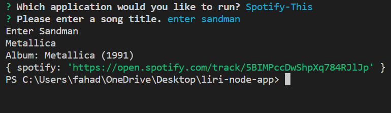

# liri-node-app

![title]:(./img/menu.png)

Hi, welcome to Liri, a simple app coded by Fahad to help pull information for you based on your input.
Choose your client from the options, and then enter a search query when prompted!

## Spotify-This

A Spotify client that will return song data:
* Title, even if user entered lowercase
* Band
* Album(Year)
* Link to open track in Spotify

## OMDB-This
![omdb]:(./img/omdb.png)
An OMDB client to scrape movie data:
* Title(Year)
* Starring
* Director
* IMDB Rating

## Concert-This
![band]:(./img/band.png)
A concert app to search for upcoming shows via Bands in Town
* Three upcoming tour dates
 * Date, formatted using Moment.js
 * Venue, and City of venue

## Do What It Says
And finally, this option will use the Node.js built-in File System module to pull a predetermined song for you from Spotify.

Enjoy!

